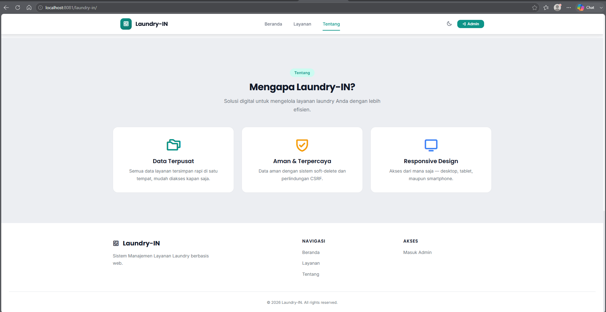
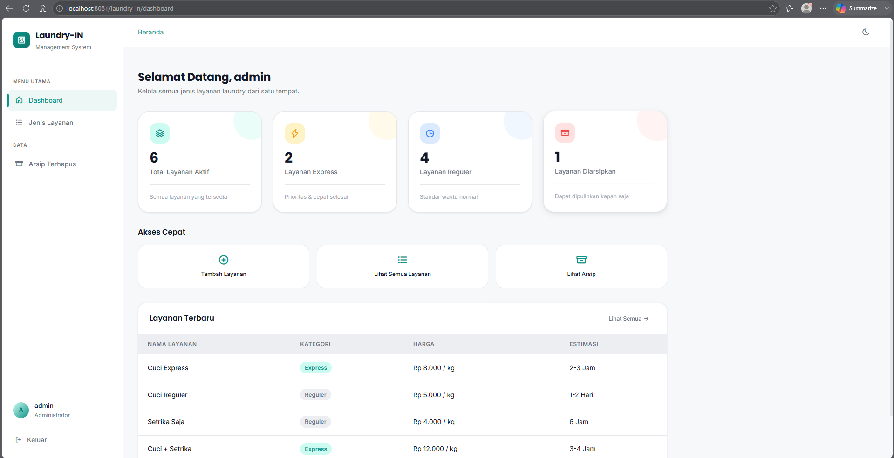
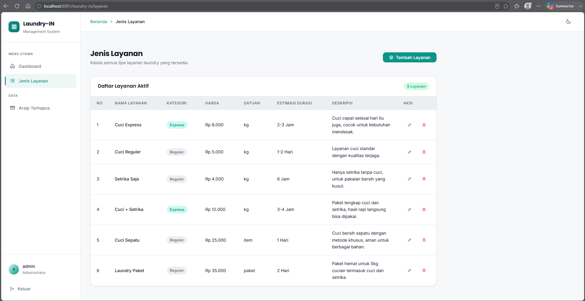
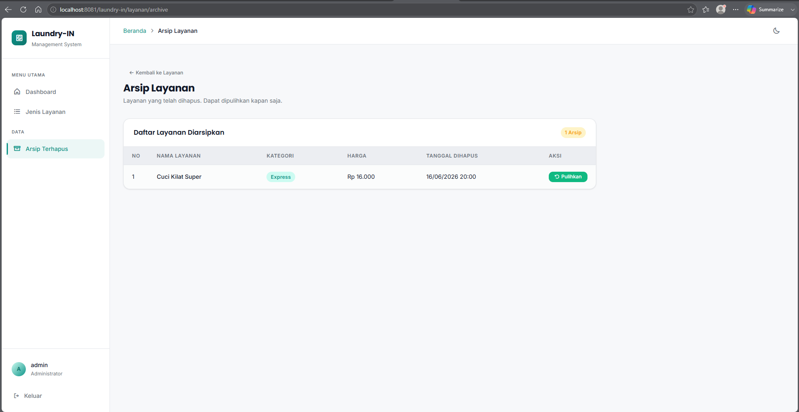

# Laundry-In

> Web app manajemen layanan laundry — Tugas Pemrograman Web
>
> _"Malas Nyuci? Laundry-In Ajaa."_

Dark-mode web application untuk manajemen katalog layanan laundry berbasis **Native PHP MVC + CodeIgniter 4**. Menampilkan layanan ke publik dan menyediakan panel admin untuk CRUD jenis layanan dan pelanggan, dengan fitur soft delete, arsip, export PDF, dan shopping cart.

## Screenshots

| #   | Page                  | Preview                                                   |
| --- | --------------------- | --------------------------------------------------------- |
| 1   | Landing — Hero        |                    |
| 2   | Landing — Layanan     |                    |
| 3   | Landing — Tentang     |                    |
| 4   | Admin — Login         |            |
| 5   | Admin — Dashboard     |    |
| 6   | Admin — Jenis Layanan |  |
| 7   | Admin — Tambah        |        |
| 8   | Admin — Arsip         |  |

## Stack

- **Framework:** Native PHP MVC + CodeIgniter 4 (routing, migration, seeder)
- **Language:** PHP 8.1+
- **Database:** MariaDB 10.6+ (via XAMPP) — `kampusin_db`
- **DB Driver:** PDO with Prepared Statements + CI4 MySQLi
- **PDF Export:** Dompdf 3.1+ via Composer
- **Frontend:** Vanilla CSS (dark/light mode design system), Vanilla JS
- **Icons:** Phosphor Icons 2.1.1 via CDN
- **Typography:** Inter + Poppins via Google Fonts

## Setup (v1.0 — SQL Manual)

```bash
# 1. Clone repository
git clone https://github.com/CHUUL07/Laundry.git
cd laundry-in

# 2. Copy & configure environment
cp .env.example .env
# Edit .env: set DB credentials (DB_HOST, DB_PORT, DB_NAME, DB_USER, DB_PASS)

# 3. Import database structure
mysql -u root -p kampusin_db < docs/kampusin_db_structure.sql

# 4. Import seed data (opsional, tapi disarankan)
mysql -u root -p kampusin_db < docs/kampusin_db_seed.sql

# 5. Akses aplikasi
# http://localhost/laundry-in/
```

## Setup (v2.0 — CI4 Migration & Seeder)

```bash
# 1. Clone repository
git clone https://github.com/CHUUL07/Laundry.git
cd laundry-in

# 2. Copy & configure environment
cp .env.example .env
# Edit .env: set DB credentials

# 3. Install Composer dependencies
composer install

# 4. Jalankan migration (buat tabel)
php spark migrate

# 5. Seed data awal
php spark db:seed DatabaseSeeder

# 6. Akses via built-in server
php spark serve
# Buka: http://localhost:8080/
#
# Atau via XAMPP:
# http://localhost/laundry-in/public/
```

## Admin Access

| URL          | http://localhost/laundry-in/login |
| ------------ | --------------------------------- |
| **Username** | `admin`                           |
| **Password** | `admin123`                        |

## Fitur v2.0 (Patch Update)

- **CRUD Pelanggan** (Tambah, Edit, Soft Delete, Restore, Arsip) — SOAL 01
- **Migration & Seeder CI4** (`php spark migrate`, `php spark db:seed DatabaseSeeder`) — SOAL 02
- **Export PDF** daftar layanan menggunakan Dompdf (A4 Landscape) — SOAL 04
- **Shopping Cart** berbasis session (insert, update, total, remove, destroy) — SOAL 05
- **Login hardening** dengan rate limiting (5 percobaan, lockout 5 menit) — SOAL 03
- Dashboard diperbarui dengan summary cards Pelanggan

## Pemenuhan Soal Ujian

| Soal      | Keterangan                                            | Bobot    |
| --------- | ----------------------------------------------------- | -------- |
| SOAL 01   | CRUD Layanan + CRUD Pelanggan dengan Soft Delete      | 20%      |
| SOAL 02   | Migration CI4 + Seeder CI4 + Model                    | 20%      |
| SOAL 03   | Login validasi dari database (bcrypt) + rate limiting | 20%      |
| SOAL 04   | Export PDF menggunakan Dompdf                         | 20%      |
| SOAL 05   | Cart Library: insert, update, total, remove, destroy  | 20%      |
| **Total** |                                                       | **100%** |

## Fitur

### Publik

- Landing page hero dengan ilustrasi laundry + headline "Kelola Layanan Laundry Lebih Mudah"
- Navigasi sticky dengan efek underline active (IntersectionObserver)
- Katalog layanan dalam bentuk card grid (responsive: 3 &rarr; 2 &rarr; 1 kolom)
- Badge kategori (Express / Reguler) dengan warna berbeda
- Format harga Rp otomatis (number_format)
- Dark Mode / Light Mode toggle dengan persistensi localStorage
- IntersectionObserver untuk update active nav saat scroll
- Mobile hamburger menu dengan animasi smooth

### Admin

- Session-based authentication (login/logout) dengan CSRF protection
- Dashboard dengan summary cards (total aktif, express, reguler, arsip, pelanggan)
- CRUD lengkap untuk Jenis Layanan dan Pelanggan
- Soft delete dengan konfirmasi modal (data tidak hilang permanen)
- Arsip & restore data yang telah dihapus
- Export PDF daftar layanan menggunakan Dompdf
- Shopping Cart berbasis session (insert, update, total, remove, destroy)
- Login rate limiting (5 percobaan gagal = lockout 5 menit)
- Flash messages untuk setiap aksi CRUD (Phosphor icons)
- CSRF protection di semua POST form
- XSS prevention via htmlspecialchars()
- Fully responsive (mobile, tablet, desktop)

## Database

Database `kampusin_db` berisi 3 tabel:

### Table: `admins`

| Column     | Type         | Keterangan                |
| ---------- | ------------ | ------------------------- |
| id         | INT(11) PK   | Auto increment            |
| username   | VARCHAR(50)  | Unique                    |
| password   | VARCHAR(255) | bcrypt hash               |
| created_at | DATETIME     | Default CURRENT_TIMESTAMP |

### Table: `jenis_layanan`

| Column          | Type          | Keterangan                  |
| --------------- | ------------- | --------------------------- |
| id              | INT(11) PK    | Auto increment              |
| nama_layanan    | VARCHAR(100)  | Nama layanan                |
| kategori        | ENUM          | 'express' atau 'reguler'    |
| harga           | INT(11)       | Harga dalam Rupiah          |
| satuan_harga    | ENUM          | 'kg', 'item', atau 'paket'  |
| estimasi_durasi | VARCHAR(50)   | Contoh: "2-3 Jam", "1 Hari" |
| deskripsi       | TEXT NULL     | Deskripsi layanan           |
| created_at      | DATETIME      | Default CURRENT_TIMESTAMP   |
| updated_at      | DATETIME      | ON UPDATE CURRENT_TIMESTAMP |
| deleted_at      | DATETIME NULL | Soft delete marker          |

### Table: `pelanggan`

| Column         | Type          | Keterangan                  |
| -------------- | ------------- | --------------------------- |
| id             | INT(11) PK    | Auto increment              |
| nama_pelanggan | VARCHAR(100)  | Nama pelanggan              |
| no_telp        | VARCHAR(20)   | Nomor telepon               |
| email          | VARCHAR(100)  | Alamat email (nullable)     |
| alamat         | TEXT          | Alamat lengkap (nullable)   |
| created_at     | DATETIME      | Default CURRENT_TIMESTAMP   |
| updated_at     | DATETIME      | ON UPDATE CURRENT_TIMESTAMP |
| deleted_at     | DATETIME NULL | Soft delete marker          |

## Routes

### v1.0 Routes (Layanan + Auth)

| Method | URL                     | Controller / Method               |
| ------ | ----------------------- | --------------------------------- |
| GET    | `/`                     | `LandingController::index()`      |
| GET    | `/login`                | `AuthController::showLogin()`     |
| POST   | `/login`                | `AuthController::processLogin()`  |
| GET    | `/logout`               | `AuthController::logout()`        |
| GET    | `/dashboard`            | `DashboardController::index()`    |
| GET    | `/layanan`              | `LayananController::index()`      |
| GET    | `/layanan/create`       | `LayananController::create()`     |
| POST   | `/layanan/store`        | `LayananController::store()`      |
| GET    | `/layanan/edit/{id}`    | `LayananController::edit($id)`    |
| POST   | `/layanan/update/{id}`  | `LayananController::update($id)`  |
| POST   | `/layanan/delete/{id}`  | `LayananController::delete($id)`  |
| GET    | `/layanan/archive`      | `LayananController::archive()`    |
| POST   | `/layanan/restore/{id}` | `LayananController::restore($id)` |

> Semua route kecuali `/`, `/login`, dan `/login` POST dilindungi oleh `requireAuth()`.

### v2.0 Routes (Pelanggan + Cart + PDF)

| Method | URL                       | Controller / Method                 |
| ------ | ------------------------- | ----------------------------------- |
| GET    | `/pelanggan`              | `PelangganController::index()`      |
| GET    | `/pelanggan/create`       | `PelangganController::create()`     |
| POST   | `/pelanggan/store`        | `PelangganController::store()`      |
| GET    | `/pelanggan/edit/{id}`    | `PelangganController::edit($id)`    |
| POST   | `/pelanggan/update/{id}`  | `PelangganController::update($id)`  |
| POST   | `/pelanggan/delete/{id}`  | `PelangganController::delete($id)`  |
| GET    | `/pelanggan/archive`      | `PelangganController::archive()`    |
| POST   | `/pelanggan/restore/{id}` | `PelangganController::restore($id)` |
| GET    | `/layanan/export-pdf`     | `LayananController::exportPdf()`    |
| GET    | `/cart`                   | `CartController::index()`           |
| POST   | `/cart/add/{id}`          | `CartController::add($id)`          |
| POST   | `/cart/update/{id}`       | `CartController::update($id)`       |
| POST   | `/cart/remove/{id}`       | `CartController::remove($id)`       |
| POST   | `/cart/destroy`           | `CartController::destroy()`         |

## Struktur

```
laundry-in/
├── index.php                       # Thin redirect ke public/ (CI4 entry)
├── .htaccess                       # Rewrite ke public/index.php
├── .env                            # Database credentials (gitignored)
├── .env.example                    # Template environment
├── .gitignore
├── README.md
├── PRD.md
├── Planning.md
├── Patch_Update_v2.md
├── State.md
│
├── app/
│   ├── Config/
│   │   ├── App.php                 # CI4 baseURL config
│   │   ├── Database.php            # CI4 database config
│   │   └── Routes.php              # CI4 routes (ALL routes)
│   ├── Controllers/
│   │   ├── AuthController.php      # Login, logout + rate limiting
│   │   ├── CartController.php      # Shopping Cart (BARU v2.0)
│   │   ├── DashboardController.php # Dashboard + pelanggan count
│   │   ├── LayananController.php   # CRUD Layanan + exportPdf
│   │   ├── PelangganController.php # CRUD Pelanggan (BARU v2.0)
│   │   └── LandingController.php   # Public landing page
│   ├── Database/
│   │   ├── Migrations/             # BARU v2.0 (SOAL 02)
│   │   │   ├── 2026-06-29-000001_CreateAdminsTable.php
│   │   │   ├── 2026-06-29-000002_CreateJenisLayananTable.php
│   │   │   └── 2026-06-29-000003_CreatePelangganTable.php
│   │   └── Seeds/                  # BARU v2.0 (SOAL 02)
│   │       ├── DatabaseSeeder.php
│   │       ├── AdminSeeder.php
│   │       ├── LayananSeeder.php
│   │       └── PelangganSeeder.php
│   ├── Helpers/
│   │   └── auth.php                # requireAuth(), CSRF, rate limiting
│   ├── Libraries/
│   │   ├── Cart.php                # Shopping Cart (BARU v2.0)
│   │   └── Database.php            # PDO connection singleton
│   ├── Models/
│   │   ├── BaseModel.php           # Abstract base (query, execute, etc.)
│   │   ├── AdminModel.php          # Admin authentication
│   │   ├── LayananModel.php        # CRUD + soft delete + restore
│   │   └── PelangganModel.php      # CRUD Pelanggan (BARU v2.0)
│   └── Views/
│       ├── layouts/
│       │   ├── main.php            # Admin layout (sidebar + topbar)
│       │   ├── auth.php            # Login layout (centered card)
│       │   └── landing.php         # Public layout
│       ├── auth/
│       │   └── login.php           # Login form
│       ├── cart/                   # BARU v2.0
│       │   └── index.php           # Shopping Cart view
│       ├── dashboard/
│       │   └── index.php           # Summary cards + quick actions
│       ├── landing/
│       │   └── index.php           # Landing page view
│       ├── layanan/
│       │   ├── index.php           # Active services + cart buttons + export PDF
│       │   ├── create.php          # Add service form
│       │   ├── edit.php            # Edit service form
│       │   ├── archive.php         # Archived services
│       │   └── pdf.php             # Dompdf template (BARU v2.0)
│       └── pelanggan/              # BARU v2.0
│           ├── index.php           # Daftar pelanggan
│           ├── create.php          # Form tambah pelanggan
│           ├── edit.php            # Form edit pelanggan
│           └── archive.php         # Arsip pelanggan
│
├── assets/                         # Dipindah dari public/ (v1.0)
│   ├── css/
│   │   ├── variables.css           # CSS custom properties (light/dark)
│   │   ├── reset.css               # CSS reset & base styles
│   │   ├── layout.css              # Sidebar, topbar, grid
│   │   ├── components.css          # Buttons, cards, tables, forms, modals
│   │   ├── utilities.css           # Utility classes
│   │   └── landing.css             # Landing page styles
│   ├── js/
│   │   ├── theme.js                # Dark/light mode toggle
│   │   ├── sidebar.js              # Mobile sidebar toggle
│   │   ├── modal.js                # Delete confirmation modal
│   │   └── landing.js              # Landing interactions
│   └── images/
│       ├── Gambar-Laundry.png      # Hero illustration
│       └── Screenshots (8)
│
├── docs/                           # Dokumentasi
├── vendor/                         # Composer (dompdf)
├── writable/                       # CI4 writable dir
└── public/
    └── index.php                   # CI4 entry point
│
├── docs/
│   ├── PRD.md
│   ├── Planning.md
│   ├── kampusin_db_structure.sql         # Table structure export
│   └── kampusin_db_seed.sql              # Seed data export
│
└── vendor/                               # Composer dependencies (CodeIgniter 4)
```

## Keamanan

| Threat            | Mitigation                                              |
| ----------------- | ------------------------------------------------------- |
| SQL Injection     | 100% PDO prepared statements dengan bound params        |
| XSS               | Semua output via `htmlspecialchars()`                   |
| CSRF              | Token CSRF di setiap form POST + validasi server-side   |
| Session Hijacking | `session_regenerate_id(true)` saat login                |
| Password          | Bcrypt hash via `password_hash()` / `password_verify()` |
| Direct Access     | `.htaccess` blokir akses langsung ke `app/` directory   |
