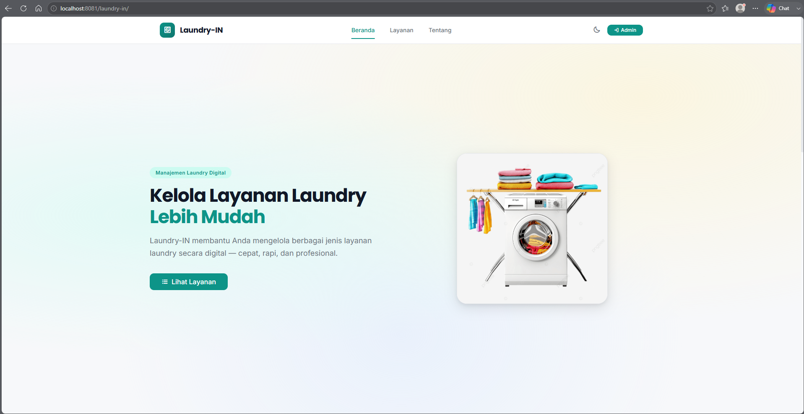
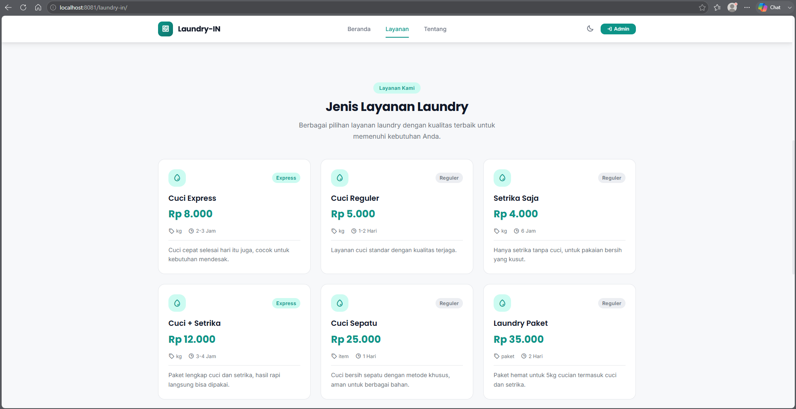
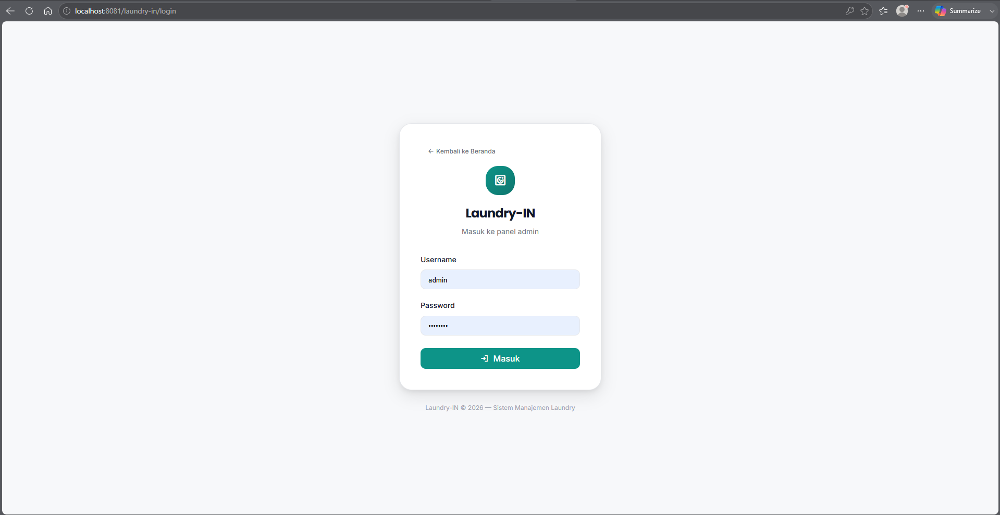
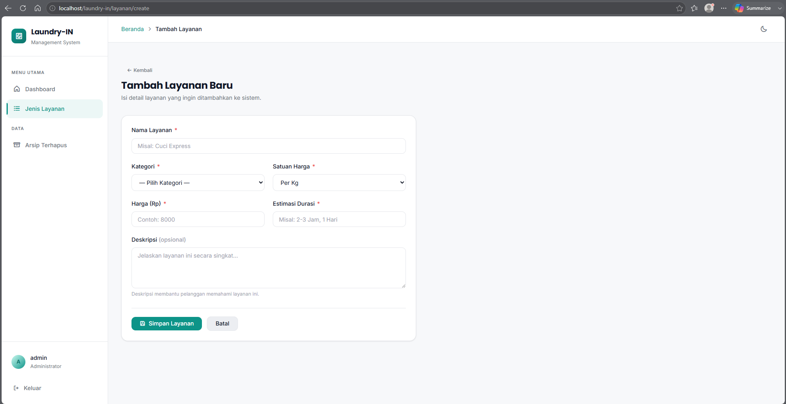

# Laundry-In

> Web app manajemen layanan laundry — Tugas Pemrograman Web
>
> _"Malas Nyuci? Laundry-In Ajaa."_

Dark-mode web application untuk manajemen katalog layanan laundry berbasis **Native PHP MVC**. Menampilkan layanan ke publik dan menyediakan panel admin untuk CRUD jenis layanan dengan fitur soft delete dan arsip.

## Screenshots

| #   | Page                  | Preview                                                          |
| --- | --------------------- | ---------------------------------------------------------------- |
| 1   | Landing — Hero        |                    |
| 2   | Landing — Layanan     |                    |
| 3   | Landing — Tentang     |                    |
| 4   | Admin — Login         |            |
| 5   | Admin — Dashboard     |    |
| 6   | Admin — Jenis Layanan |  |
| 7   | Admin — Tambah        |        |
| 8   | Admin — Arsip         |  |

## Stack

- **Framework:** Native PHP MVC (tanpa framework)
- **Language:** PHP 8.1+
- **Database:** MariaDB 10.6+ (via XAMPP) — `kampusin_db`
- **DB Driver:** PDO with Prepared Statements
- **Frontend:** Vanilla CSS (dark/light mode design system), Vanilla JS
- **Icons:** Phosphor Icons 2.1.1 via CDN
- **Typography:** Inter + Poppins via Google Fonts

## Setup

```bash
# 1. Clone repository
git clone https://github.com/CHUUL07/Laundry.git
cd laundry-in

# 2. Copy & configure environment
cp .env.example .env
# Edit .env: set DB credentials (DB_HOST, DB_PORT, DB_NAME, DB_USER, DB_PASS)

# 3. Import database structure
mysql -u root -p kampusin_db < docs/kampusin_db_structure.sql

# 4. Import seed data (opsional, tapi disarankan)
mysql -u root -p kampusin_db < docs/kampusin_db_seed.sql

# 5. Akses aplikasi
# http://localhost/laundry-in/
```

## Admin Access

| URL          | http://localhost/laundry-in/login |
| ------------ | --------------------------------- |
| **Username** | `admin`                           |
| **Password** | `admin123`                        |

## Fitur

### Publik

- Landing page hero dengan ilustrasi laundry + headline "Kelola Layanan Laundry Lebih Mudah"
- Navigasi sticky dengan efek underline active (IntersectionObserver)
- Katalog layanan dalam bentuk card grid (responsive: 3 &rarr; 2 &rarr; 1 kolom)
- Badge kategori (Express / Reguler) dengan warna berbeda
- Format harga Rp otomatis (number_format)
- Dark Mode / Light Mode toggle dengan persistensi localStorage
- IntersectionObserver untuk update active nav saat scroll
- Mobile hamburger menu dengan animasi smooth

### Admin

- Session-based authentication (login/logout) dengan CSRF protection
- Dashboard dengan summary cards (total aktif, express, reguler, arsip)
- CRUD lengkap untuk Jenis Layanan
- Soft delete dengan konfirmasi modal (data tidak hilang permanen)
- Arsip & restore layanan yang telah dihapus
- Flash messages untuk setiap aksi CRUD (Phosphor icons)
- CSRF protection di semua POST form
- XSS prevention via htmlspecialchars()
- Fully responsive (mobile, tablet, desktop)

## Database

Database `kampusin_db` berisi 2 tabel:

### Table: `admins`

| Column     | Type         | Keterangan                |
| ---------- | ------------ | ------------------------- |
| id         | INT(11) PK   | Auto increment            |
| username   | VARCHAR(50)  | Unique                    |
| password   | VARCHAR(255) | bcrypt hash               |
| created_at | DATETIME     | Default CURRENT_TIMESTAMP |

### Table: `jenis_layanan`

| Column          | Type          | Keterangan                  |
| --------------- | ------------- | --------------------------- |
| id              | INT(11) PK    | Auto increment              |
| nama_layanan    | VARCHAR(100)  | Nama layanan                |
| kategori        | ENUM          | 'express' atau 'reguler'    |
| harga           | INT(11)       | Harga dalam Rupiah          |
| satuan_harga    | ENUM          | 'kg', 'item', atau 'paket'  |
| estimasi_durasi | VARCHAR(50)   | Contoh: "2-3 Jam", "1 Hari" |
| deskripsi       | TEXT NULL     | Deskripsi layanan           |
| created_at      | DATETIME      | Default CURRENT_TIMESTAMP   |
| updated_at      | DATETIME      | ON UPDATE CURRENT_TIMESTAMP |
| deleted_at      | DATETIME NULL | Soft delete marker          |

## Routes

| Method | URL                     | Controller / Method               |
| ------ | ----------------------- | --------------------------------- |
| GET    | `/`                     | `LandingController::index()`      |
| GET    | `/login`                | `AuthController::showLogin()`     |
| POST   | `/login`                | `AuthController::processLogin()`  |
| GET    | `/logout`               | `AuthController::logout()`        |
| GET    | `/dashboard`            | `DashboardController::index()`    |
| GET    | `/layanan`              | `LayananController::index()`      |
| GET    | `/layanan/create`       | `LayananController::create()`     |
| POST   | `/layanan/store`        | `LayananController::store()`      |
| GET    | `/layanan/edit/{id}`    | `LayananController::edit($id)`    |
| POST   | `/layanan/update/{id}`  | `LayananController::update($id)`  |
| POST   | `/layanan/delete/{id}`  | `LayananController::delete($id)`  |
| GET    | `/layanan/archive`      | `LayananController::archive()`    |
| POST   | `/layanan/restore/{id}` | `LayananController::restore($id)` |

> Semua route kecuali `/`, `/login`, dan `/login` POST dilindungi oleh `requireAuth()`.

## Struktur

```
laundry-in/
├── index.php                       # Front Controller + Router
├── .htaccess                       # URL rewriting (mod_rewrite)
├── .env                            # Database credentials (gitignored)
├── .env.example                    # Template environment
├── .gitignore
├── README.md
├── PRD.md
├── Planning.md
│
├── app/
│   ├── config/
│   │   └── Database.php            # PDO connection singleton
│   ├── controllers/
│   │   ├── AuthController.php      # Login, logout
│   │   ├── DashboardController.php # Dashboard page
│   │   ├── LayananController.php   # CRUD Jenis Layanan
│   │   └── LandingController.php   # Public landing page
│   ├── helpers/
│   │   └── auth.php                # requireAuth(), csrf_token(), verify_csrf()
│   ├── models/
│   │   ├── BaseModel.php           # Abstract base (query, execute, etc.)
│   │   ├── AdminModel.php          # Admin authentication
│   │   └── LayananModel.php        # CRUD + soft delete + restore
│   └── views/
│       ├── layouts/
│       │   ├── main.php            # Admin layout (sidebar + topbar)
│       │   ├── auth.php            # Login layout (centered card)
│       │   └── landing.php         # Public layout (header + hero + footer)
│       ├── auth/
│       │   └── login.php           # Login form
│       ├── dashboard/
│       │   └── index.php           # Summary cards + recent table
│       ├── landing/
│       │   └── index.php           # Landing page view
│       └── layanan/
│           ├── index.php           # Active services table
│           ├── create.php          # Add service form
│           ├── edit.php            # Edit service form
│           └── archive.php         # Archived services table
│
├── public/
│   └── assets/
│       ├── css/
│       │   ├── variables.css       # CSS custom properties (light/dark)
│       │   ├── reset.css           # CSS reset & base styles
│       │   ├── layout.css          # Sidebar, topbar, grid
│       │   ├── components.css      # Buttons, cards, tables, forms, modals
│       │   ├── utilities.css       # Utility classes
│       │   └── landing.css         # Landing page styles
│       ├── js/
│       │   ├── theme.js            # Dark/light mode toggle
│       │   ├── sidebar.js          # Mobile sidebar toggle
│       │   ├── modal.js            # Delete confirmation modal
│       │   └── landing.js          # Mobile nav, smooth scroll, IntersectionObserver
│       └── images/
│           ├── Gambar-Laundry.png  # Hero illustration
│           ├── 1-Beranda.png       # Screenshot
│           ├── 2-Layanan.png       # Screenshot
│           ├── 3-Tentang.png       # Screenshot
│           ├── 4-Login-Admin.png   # Screenshot
│           ├── 5-Dashboard-Admin.png     # Screenshot
│           ├── 6-Jenis-Layanan-Admin.png # Screenshot
│           └── 7-Tambah-Admin.png        # Screenshot
│           └── 8-Arsip-Layanan-Admin.png # Screenshot
│
├── docs/
│   ├── PRD.md
│   ├── Planning.md
│   ├── kampusin_db_structure.sql         # Table structure export
│   └── kampusin_db_seed.sql              # Seed data export
│
└── vendor/                               # Composer dependencies (CodeIgniter 4)
```

## Keamanan

| Threat            | Mitigation                                              |
| ----------------- | ------------------------------------------------------- |
| SQL Injection     | 100% PDO prepared statements dengan bound params        |
| XSS               | Semua output via `htmlspecialchars()`                   |
| CSRF              | Token CSRF di setiap form POST + validasi server-side   |
| Session Hijacking | `session_regenerate_id(true)` saat login                |
| Password          | Bcrypt hash via `password_hash()` / `password_verify()` |
| Direct Access     | `.htaccess` blokir akses langsung ke `app/` directory   |
